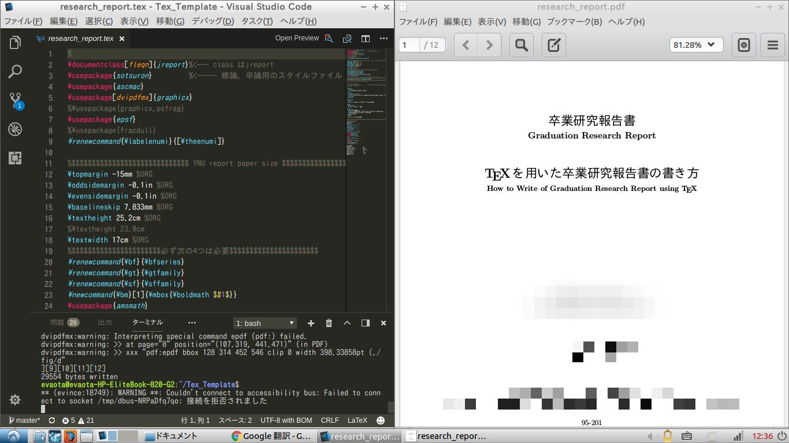

# How To Use TeX Project Template on Linux 

- ## How to Install 
    **Installed Packages**   
        1.nkf   
        2.texlive-full   
        3.latex-cjk-japanese   
        ***Worning:There packages consume free space of about 3GB!!***   
    **Command**   
    > ~/TeX_Template$ **make install**    
- ## How to Un-Install 
    **Un-Installed Packages**   
        1.nkf   
        2.texlive-full   
        3.latex-cjk-japanese   
    **Command**
    > ~/TeX_Template$ **make uninstall**   
---
- ## Main Method
    **Command**
    > ~/TeX_Template$ **make [option]**   
    
    - ### Option Lists  
        |option|work|   
        |:----:|:---:|
        |FILE=\<filename\>|Compile TeX Files of Filename Argument|   
        |clean|Remove Information Files & ./pdf directory|   
        |viewpdf|Open pdf File in ./pdf |   
    
---
- ## How to Get Start New Project
    1. [ ] Creat New Repository on github   
    2. [ ] Clone Template Repository from github   
        > ~/$ **git clone https://github.com/wakabayashiryo/TeX_Template.git**   
    3. [ ] Rename Template Folder to New Name   
    4. [ ] Move Current Directory into TeX_Template   
    5. [ ] Add New Remote Address of New Repository   
        > ~/Hoge_Project$ **git remote add hoge https://github.com/yourid/repository.git**   
    6. [ ] Push New Repository   
        > ~/Hoge_Project$ **git push hoge master**   

    **\*Worning** Do not push ***origin*** from Working Project   

    ### *How to Update Project into Template of Latest Edition*
    - Excute Below Command in Project Folder
        > git pull origin master

---
- ## Directores Structure

    - **./pdf**・・・Generated pdf File
    - **./Src**・・・TeX Documents
    - **./Src/fig**・・・Insert figures used on TeX documents.   
    ***Support Extensions*** \>> .pdf .jpg .png 
       
       **After compiled*
    ~~~ 
    .
    ├── LICENSE
    ├── Makefile
    ├── pdf
    │   └── research_report.pdf
    ├── picture
    │   └── screen.jpg
    ├── README.md
    └── Src
        ├── abstract.aux
        ├── abstract.tex
        ├── appendix.aux
        ├── appendix.tex
        ├── conclution.aux
        ├── conclution.tex
        ├── experiment.aux
        ├── fig
        │   ├── drive_circuit.eps
        │   ├── drive_circuit.pdf
        │   └── drive_circuit.xbb
        ├── introduction.aux
        ├── introduction.tex
        ├── jynu12.sty
        ├── reference.aux
        ├── reference.tex
        ├── research_report.aux
        ├── research_report.dvi
        ├── research_report.lof
        ├── research_report.log
        ├── research_report.lot
        ├── research_report.synctex.gz
        ├── research_report.tex
        ├── research_report.toc
        ├── sotsuron.sty
        ├── thanks.aux
        ├── thanks.tex
        ├── theory.aux
        └── theory.tex
        
    ~~~
---
- ## Screen in Operation
   

---
- ## Other
    
    ### **If You added Another Branchs to the Template Project, Be Sure to erase the Branch at the End.**   
    **Command**   

    > git push origin :branch-names

---
- ## LICENSE Information
    This software is released under the MIT License, see LICENSE
---
